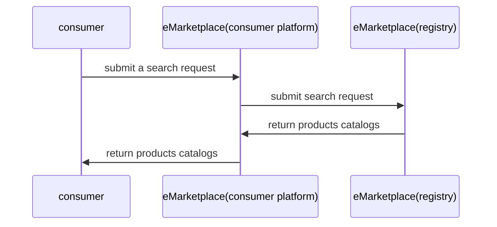
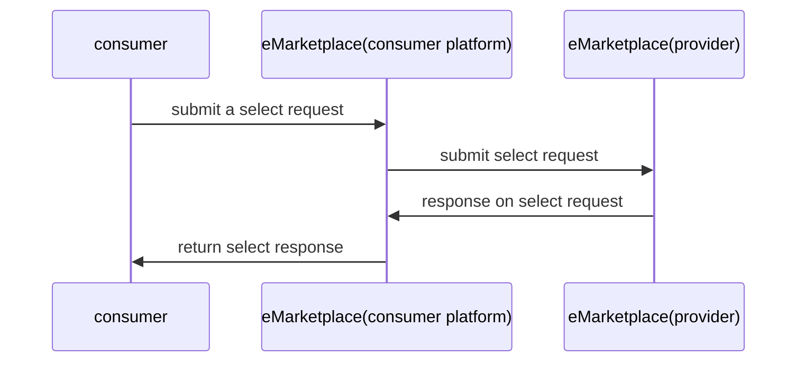
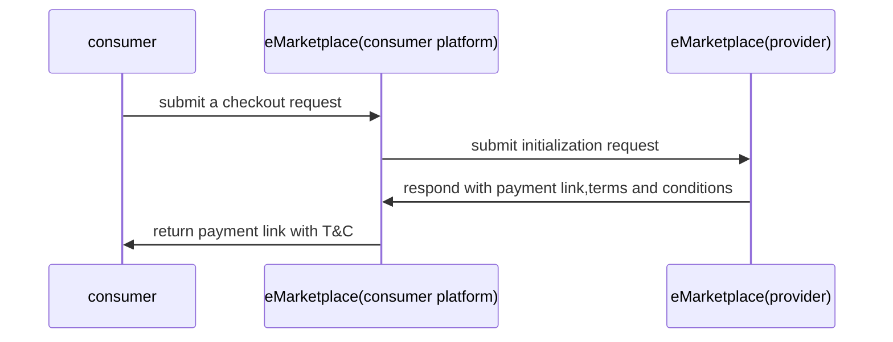
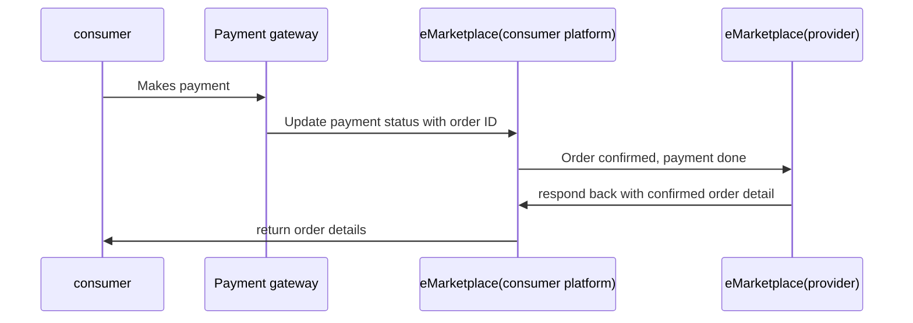
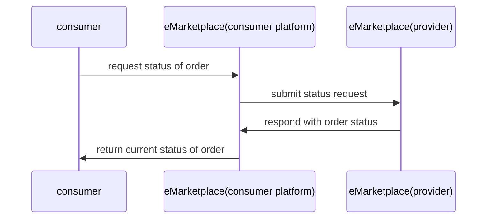

# 9 Internal Workflows


This section describes standard _internal_ workflows that a building block should support. Each internal workflow must be linked to one of the Functional Requirements defined in section 6.

An internal workflow describes the internal processes that a Building Block needs to execute to complete a request from an external application or Building Block to fulfill the functional requirement


### Consumer Workflows

It will contain all the sequence flows for the consumer platform

Sign up

login

profile update

change password

order history

### Provider Workflows

Sign up

login

profile update

change password

manage inventory

### 9.1 Searching&#x20;

This is the search flow used by the consumer to make a search for the products /services available. The platform looks up the central registry to find out list of available products/services.

### 9.2 Quote Agreement

This internal workflow is used by the consumer to select various available offers and attributes based on which pricing can vary. The consumer platform will request to the provider platform where the validation of the selected offers and attributes will be done and if there is any change will be reverted back to the consumer

### 9.3 Terms and Agreements

The consumer checks and verifies everything in the cart about the selected product/services and makes a checkout call which means there will be no more modification in the cart and he is ready to make the payment. Consumer platform makes the request to initialize a payment for the products/services in the cart and in response provider platform will revert back with the payment link and other terms and condition for payment.

### 9.4 Order Confirmation

After receiving the payment link and terms and conditions, the consumer makes a payment. After a successful payment consumer platform makes a confirm call to the provider platform. Provider platform returns with a success message and the details about the order placed which can be used to further check status of the order.

### 9.5 Contract fulfillment

Once the order is confirmed , user has the details of confirmed order, he can check for the status of the order. The order status can be place, packed, dispatched etc.

